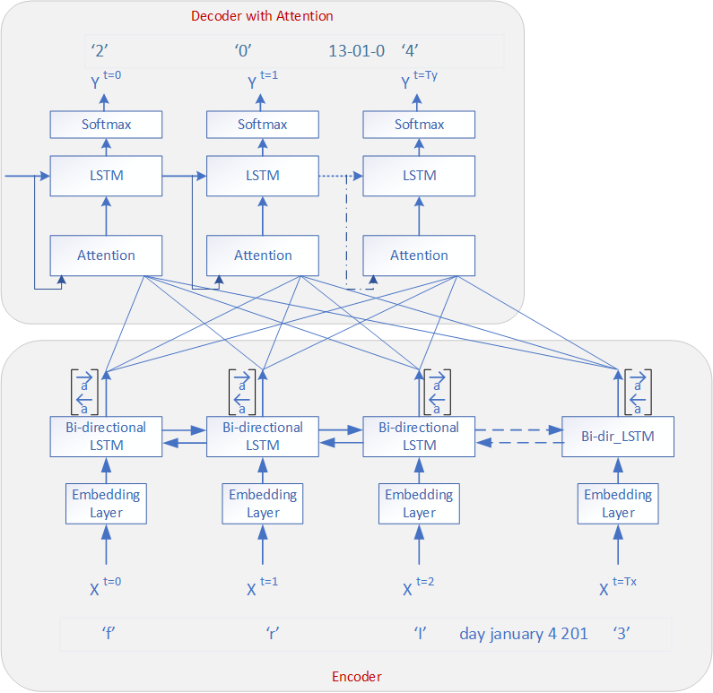

## Date Normalizing With an Attention Layer

Takes a human generated date and normalizes it into an machine-readable date. 

You can run it like so:

 `python lstm-normalize-date-w-attn.py -m eval`

The output will look llike this:

```
Input Human Date: friday january 4 2013
Predicted Machine Date: 2013-01-04 Actual Machine Date: 2013-01-04 matches
Input Human Date: january 6 2003
Predicted Machine Date: 2003-01-06 Actual Machine Date: 2003-01-06 matches
```

There are existing Keras Models that learn this task and it is taught in an NLP Coursera Course on sequence Learning. 

This is a PyTorch version thae feels a bit more natural for all the great reasons (I won't elaboraet therm here).


